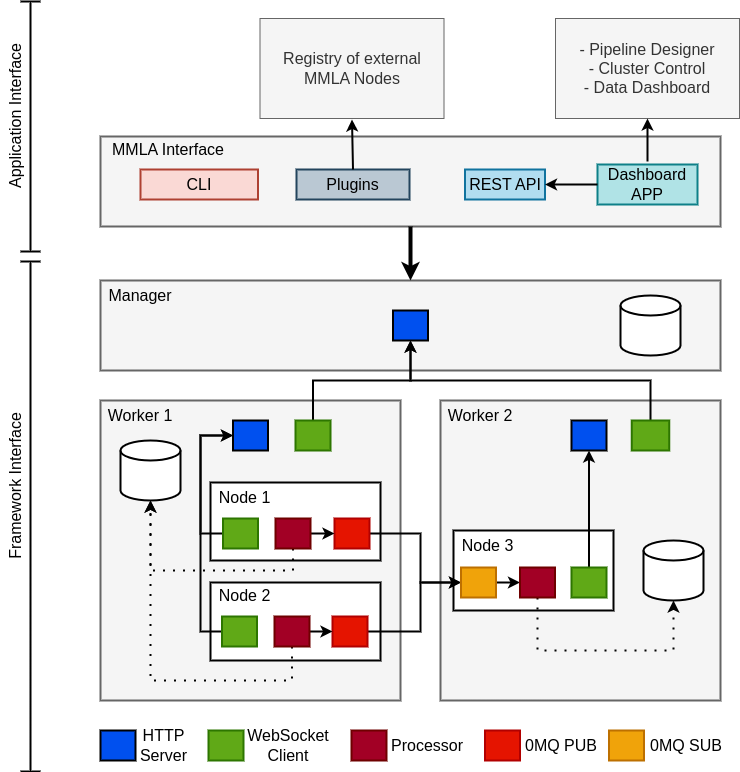

# ChimeraPy: Distributed computing framework for Multimodal data written in Python

[ChimeraPy](https://github.com/oele-isis-vanderbilt/) is a distributed computing framework for multimodal data dollection, processing, and feedback. It's a real-time streaming tool that leverages from a distributed cluster to empower AI-driven applications.

1. **Collect** your data in real-time from any computer and time aligned it to the rest of your data streams.
2. **Process** data as soon as it comes, providing a service to your users.
3. **Archive** your outputs and later retrieve them in a single main data archive for later careful post-hoc analysis.
4. **Monitor** the executing of your distributed cluster, view live outputs, and verify that you collected clean data.

## Framework
At its core, ChimeraPy is a distributed communication framework, where communication is enabled by [`ZeroMQ`](https://zeromq.org/), a high throughput communication library on enabling different communication patterns within a distributed system. Primarily, we use the publish-subscribe patterns for the communication.

The framework exposes two distinct interfaces for application developers and users:

1. **Framework Interface**: Low level API for developers to interact with the cluster.
2. **Application Interface**: High level API/CLI for developers to create and deploy multimodal pipelines.

### ChimeraPy Framework Interface
By stripping the hood of ChimeraPy and see its interworkings, it comes down to a combination of AIOHTTP, ZeroMQ, and parallel programming. The communication within ChimeraPy can be broken down into two categories: HTTP/WebSocket and PUB/SUB. The Manager and Worker send messages via HTTP and WebSockets, including the Server and Client. These messages are not the raw data streams, instead they are operational instructions and information that orchestrates the cluster execution. The data streams use a different communication protocol and channels. The intra-communication between Node uses ZeroMQ’s PUB/SUB pattern, optimized for speed, robustness, and latency. In specific, the node-communication uses the Publisher and Subscriber implementations.

Multiprocessing is at the heart of ChimeraPy, as the base class Node leverages built-in multiprocessing’s Process. Each Node executes its setup, step, and teardown within its own process, to reduce CPU bound limitations.

In the other side of the parallel programming spectrum, multithreading and AsyncIO are used for relieve the IO bound. More specifically, multithreading is used in active working while waiting, such as writing to video to memory, while AsyncIO is used for networking.

Further details can be found at ChimeraPy [documentation](https://chimerapy.readthedocs.io/en/latest/index.html).

#### Pipeline Execution with DAGs

ChimeraPy uses a peer-to-peer network to represent its data pipeline. To be more precise, ChimeraPy uses a directed acyclic graph (DAG) to model the data pipeline and data streams. The implications of a DAG is that the data streams need to be directed, meaning it must have a source and destination. Acyclic implies that the graph does not permit a cycle. This is because a cycle in a data pipeline would result in a disaster! That is because each Node will only execute once it has at least collected 1 sample from each of its dependencies, therefore a cycle to cause a deadlock.

From our use of ChimeraPy, a DAG can commonly be broken into 3 layers: data sources, data processing, and data feedback. Moreover, the DAG provides us with an explicit representation of the execution schedule, therefore no need of a scheduler.

### ChimeraPy Application Interface
Leveraging the framework utilities provided by `ChimeraPy` are strung together to create a high level interface to create and deploy multimodal pipelines. The orchestration of pipelines is enabled by using a customizable (JSON) graph configuration interface, paired with a plugin system to register external nodes for use within the framework. With this interface, user can create pipelines using their own implementation, paired with nodes from an ecosystem of nodes for external registries, and execute them by either interacting with the framework from the commandline or the REST API. We also have been working on a web dashboard application that uses the REST API to interact with the framework from the browser. Further details can be found [here](https://github.com/oele-isis-vanderbilt/ChimeraPyOrchestrator/blob/main/README.md).